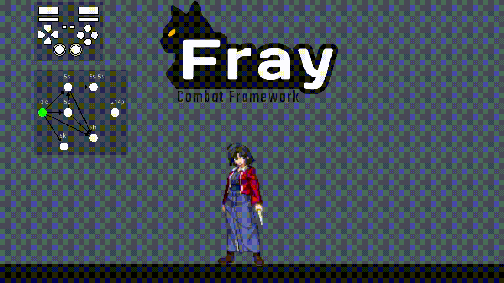

# Fray

	

  

## 📖 About

Fray is a modular Godot 4 addon designed to aid in the development of action-oriented games. It offers solutions for combatant state management, complex input detection, input buffering, and hitbox organization. If your project requires any of these functionalities you may benefit from using Fray.

## ⚠️ IMPORTANT

**Fray is in alpha! Breaking changes may still be made.**

## ✨ Core Features

- Extendable hierarchical state machine
- Complex input detection ([directional inputs](https://mugen.fandom.com/wiki/Command_input#Directional_inputs), [motion inputs](https://mugen.fandom.com/wiki/Command_input#Motion_input), [charged inputs](https://clips.twitch.tv/FuriousObservantOrcaGrammarKing-c1wo4zhroMVZ9I7y), and [sequence inputs](https://mugen.fandom.com/wiki/Command_input#Sequence_inputs))
- Hitbox management

## 📚 Getting Started

Fray comes with comprehensive documentation integrated with Godot 4's documentation comments. This means you can access explanations for classes and functions directly within the Godot editor.

For additional guides and resources, check out the [official Fray wiki](https://fray.pyxus.dev).

## 📦 Installation

1. Clone or download a copy of this repository.
2. Copy the contents of the repo into `res://addons/fray` directory.
3. Enable `Fray - Combat Framework` in your project plugins.

Alternatively if using git the project can be added as a sub module like so:
`git submodule add https://github.com/Pyxus/fray.git ./addons/fray`

If you would like to know more about installing plugins see the [Official Godot Docs](https://docs.godotengine.org/en/stable/tutorials/plugins/editor/installing_plugins.html).

## 📃 Credits

- Controller Button Images : <https://thoseawesomeguys.com/prompts/>
