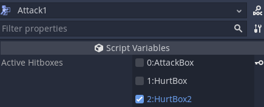

# Fray

<p align="center">
    
</p>


  

## 📖 About

Fray is a work in progress addon for the [Godot Game Engine](https://godotengine.org) that provides tools which aid in the development of action / fighting game combat. If your project requires changes in combatant state corresponding to button presses, input buffering, detecing complex player inputs, or hitbox management then you may benefit from using Fray!


[Demo](https://github.com/Pyxus/fray/releases/download/v1.0.0/fray_demo.zip) showcasing input processing and state mangaement.


## ✨ Core Features

### Modular Design

Fray is divided into 3 modules: State, Input, and Collision. These modules act independent of one another and only communicate through string identifiers. This means you are not locked in to using Fray's tools and can run your own solutions along side it by interpreting these strings in your current setup.

### Combat State Management

Fray provides a combat state machine that allows you to keep track of a fighter's state and automatically transition to new states based on the player's inputs.
Transitions in the state machine can be enabled and disabled through code or the animation player; through this Fray supports the implementation of [chaining](https://glossary.infil.net/?t=Chain). For example, If transitions are allowed early into an attack animation then the attack can, in effect, be canceled into a new attack.

State machines can be defined declaratively using the included builder classes.

```gdscript
combat_state_machine.add_situation("on_ground", CombatSituationBuilder.new()\
    .transition_button("idle", "attack1", {input = "attack_button"})\
    .transition_button("attack1", "attack2", {input = "attack_button"})\
    .start_at("idle")\
    .build()
)
```

### Input Buffering

Inputs fed to fray's combat state machine are buffered allowing a player to queue their next action before the current action has finished. [Buffering](https://en.wiktionary.org/wiki/Appendix:Glossary_of_fighting_games#Buffering) is an important feature in action / fighting games as without it players would need frame perfect inputs to smoothly perform a sequence of actions.

### Complex Input Detection

Fray provides a component based input builder, and sequence analyzer for handling the 'complex' inputs featured in many fighting games such as [directional inputs](https://mugen.fandom.com/wiki/Command_input#Directional_inputs), [motion inputs](https://mugen.fandom.com/wiki/Command_input#Motion_input), [charged inputs](https://clips.twitch.tv/FuriousObservantOrcaGrammarKing-c1wo4zhroMVZ9I7y), and [sequence inputs](https://mugen.fandom.com/wiki/Command_input#Sequence_inputs).

Composite inputs can be defined declaratively using the `CompositeInputFactory` class.

```gdscript
# Binds are used as the 'leafs' of composite input component trees.
FrayInputMap.add_bind_action("right", "right")
FrayInputMap.add_bind_action("down", "down")

# Describes a combination input which changes based on what side the player is on.
FrayInputMap.add_composite_input("down_forward", CIF.new_conditional()\
    .add_component("", CIF.new_combination_async()\
        .add_component(CIF.new_simple(["down"]))\
        .add_component(CIF.new_simple(["right"])))\
    .add_component("on_right", CIF.new_combination_async()\
        .add_component(CIF.new_simple(["down"]))\
        .add_component(CIF.new_simple(["left"])))\
    .is_virtual()\
    .build()
)
```

Sequence inputs can be defined using the `SequenceList` class, and then registered to the `SequenceAnalyzer`.
The sequence analyzer can then be fed inputs and will emit a signal if any matches are found.

```gdscript
var sequence_list := SequenceList.new()

sequence_list.add("236p", SequencePath.new()\
    .then("down").then("down_forward").then("forward").then("punch"))

# An alias sequence can be created by adding a new path with the same sequence name
sequence_list.add("214p", SequencePath.new()\
    .then("down").then("forward").then("punch"))
```

### Hitbox Management

Fray provides a template hitbox which is an `Area` node with an `attributes` property. Attributes can be extended to determine the properties of the hitbox they are attached to. In addition, Fray provides tools for managing these hitboxes in the form of hit states. Hit states can control which hitbox child node is active through a single property in the inspector which can be keyed in animations for easy syncing.




## 📦 Installation

1. Clone or download a copy of this repository.
2. Copy the contents of `addons/` into your `res://addons/` directory.
3. Enable `Fray - Combat Framework` in your project plugins.

If you would like to know more about installing plugins see the [Official Godot Docs](https://docs.godotengine.org/en/stable/tutorials/plugins/editor/installing_plugins.html).

## 📚 Documentation

- [Getting Started](./docs/getting_started/index.md)
- Fray API (Coming Eventually)

## 📃 Credits

- Controller Button Images : <https://thoseawesomeguys.com/prompts/>
- Demo Player Sprite : <https://www.spriters-resource.com/playstation_2/mbaa/sheet/28116/>
