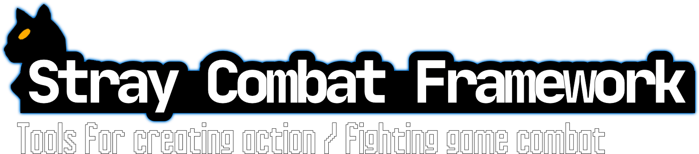

# 

   

Stray Combat Framework (SCF) is a work in progress addon for the [Godot Game Engine](https://godotengine.org). It features tools for implementing action / fighting game style combat such as hit detection, input buffering, and fighter state management.

## ⚠️ Important

**SCF is in alpha! Extensive testing is still required, breaking changes may still be made, and parts of the features below may not yet be fully implemented.**

## ✨ Core Features

### Hit Box Management

Provides tools for managing a fighter's hitbox based on their current state.

### Fighter State Management

SCF features a hiearchacel state machine that allows you to keep track of a fighter's combat state and automatically advance to new states based on the player's inputs. In other words this system lets you switch from one attack to another based on a predefined "action graph".

Through this system SCF supports the implementation of [chaining](https://glossary.infil.net/?t=Chain).

### Input Buffering

Inputs fed to the state management system can be buffered allowing a player to queue their next action before the current action has finished. Buffering is an important feature in action games as without it players would need frame perfect inputs to perform their actions.

### Complex Input Support

SCF provides support for the 'complex' inputs featured in many fighting games such as [directional inputs](https://mugen.fandom.com/wiki/Command_input#Directional_inputs), [motion inputs](https://mugen.fandom.com/wiki/Command_input#Motion_input), [charged inputs](https://clips.twitch.tv/FuriousObservantOrcaGrammarKing-c1wo4zhroMVZ9I7y), and [sequence inputs](https://mugen.fandom.com/wiki/Command_input#Sequence_inputs).

This support is provided through...

- **Combination Inputs** : Distinct virtual inputs resulting from the press of 2 or more buttons. For example pressing down + right in most 2D fighting games are detected as a distinct diagonal button press even though no such diagonal button exists.

- **Conditional Inputs** : Inputs that change due to some condition. For instance in most 2D fighting games the direction of a quarter circle input changes based on which side of you stand relative to your opponent.

- **Input Sequence Detection** : Scans input stream and detects predefined sequences.

## ⚙ Installation

1. Clone or download a copy of this repository.
2. Copy the contents of `addons/` into your `res://addons/` directory.
3. Enable `Stray Combat Framework` in your project plugins.

If you would like to know more about installing plugins see the [Official Godot Docs](https://docs.godotengine.org/en/stable/tutorials/plugins/editor/installing_plugins.html).

## 📚 Documentation

- Getting Started (Coming Eventually)
- Stray API (Coming Eventually)

## 📃 Credits

### 🎨 Assets

- Controller Button Images : <https://thoseawesomeguys.com/prompts/>
- Player Example Sprite : <https://www.spriters-resource.com/playstation_2/mbaa/sheet/28116/>
