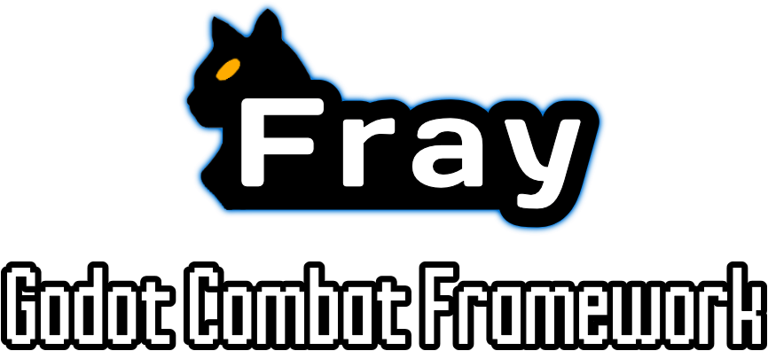

# Fray

    

   

## 📖 About

Fray is a work in progress addon for the [Godot Game Engine](https://godotengine.org) that provides tools which aid in the development of action / fighting game combat. If your project requires changes in combatant state corresponding to button presses, input buffering, detecing complex player inputs, or hitbox management then you may benefit from using Fray!

## ⚠️ IMPORTANT

**This addon is in alpha! Breaking changes may still be made.**

## ✨ Core Features

### Modular Design

Fray is divided into 3 modules: State, Input, and Collision. These modules act independent of one another and only communicate through string identifiers. This means you are not locked in to using Fray's tools and can run your own solutions along side it by interpreting these strings in your current setup.

### Combat State Management

Fray features a state machine that allows you to keep track of a fighter's combat state and automatically transition to new states based on the player's inputs.
Transitions in the state machine can be enabled and disabled in the animation player. If transitions are allowed early into an attack animation then the attack can, in effect, be canceled into a new attack. Through this Fray supports the implementation of [chaining](https://glossary.infil.net/?t=Chain).

### Input Buffering

Inputs fed to fray's combat state management system can be buffered allowing a player to queue their next action before the current action has finished. [Buffering](https://en.wiktionary.org/wiki/Appendix:Glossary_of_fighting_games#Buffering) is an important feature in action / fighting games as without it players would need frame perfect inputs to perform subsequent actions.

### Complex Input Detection

Fray provides tools for detecting the 'complex' inputs featured in many fighting games such as [directional inputs](https://mugen.fandom.com/wiki/Command_input#Directional_inputs), [motion inputs](https://mugen.fandom.com/wiki/Command_input#Motion_input), [charged inputs](https://clips.twitch.tv/FuriousObservantOrcaGrammarKing-c1wo4zhroMVZ9I7y), and [sequence inputs](https://mugen.fandom.com/wiki/Command_input#Sequence_inputs).

### Hitbox Management

Fray provides a template hitbox which is an `Area` node with an `attributes` property. Attributes can be extended to determine the properties of the hitbox they are attached to. In addition, Fray provides tools for managing these hitboxes in the form of hit states. Hit states can control which hitbox child node is active through a single property in the inspector which can be keyed in animations for easy syncing.

## ⚙ Installation

1. Clone or download a copy of this repository.
2. Copy the contents of `addons/` into your `res://addons/` directory.
3. Enable `Fray - Combat Framework` in your project plugins.

If you would like to know more about installing plugins see the [Official Godot Docs](https://docs.godotengine.org/en/stable/tutorials/plugins/editor/installing_plugins.html).

## 📚 Documentation

- [Getting Started](./docs/getting_started/index.md)
- Fray API (Coming Eventually)

## 📃 Credits

### 🎨 Assets

- Controller Button Images : <https://thoseawesomeguys.com/prompts/>
- Player Example Sprite : <https://www.spriters-resource.com/playstation_2/mbaa/sheet/28116/>
