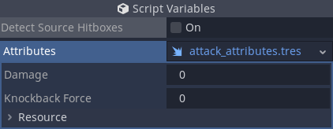

# Collision Module

## Introduction

This module contains scripts related to hit detection and hitbox management.

## Hitbox2D/3D

The hitbox node doesn't provide much functionality out of the box. But what it does provide is a template that you can expand upon through the use of attributes.

### Hit Detection

The hitbox node includes a `hitbox_intersected` and `hitbox_seperated` signal that can be used for hit detection.

### HitboxAttributes
`HitboxAttributes` are a resource that can be given to hitboxes to provide attribute data for use during hit detection. Attributes can also determine what hitboxes another hitbox can interact with by overriding the `_allows_detection_of_impl()` virtual method.



Example Usage: 

Suppose you wanted to create a hurt box (box that detects attacks), and attack box (box that causes damage). Rather than extend the hitbox class, instead extend the `HitboxAttributes` class to create an `AttackAttributes` and `HurtAttributes` respectively. The attribute attached to the hitbox then essentially determines its type. Attributes can then be referenced during hit detection to influence the response such as how much damage an attack deals.

```gdscript
# hurt_attributes.gd
extends Fray.Collision.HitboxAttributes

# Just an import for type testing.
# We load rather than preload to prevent cyclic reference errors.
var AttackAttributes = load("attack_attributes.gd")

# In this example we only want hurt boxes to detect attack boxes.
# We can do this by overriding this virtual method.
func _allows_detection_of_impl(attributes: Resource) -> void:
    return attributes is AttackAttributes

```

```gdscript
# attack_attributes.gd
extends Fray.Collision.HitboxAttributes

# Example exports to showcase the kind of data you might associate with an attack.
export var damage: float
export var knockback_force: float
```

## HitState2D/3D

In fighting games you'll often see single actions with multiple discrete hitbox confiugrations. Managing multiple hitboxes in the scene tree could get tedious. To handle this fray includes a hit state node which allows you to manage multiple hitboxes from a single access point.


### Managing hitboxes

Hitboxes added as direct children of the hit state node will appear in the inspector allowing you to control which hitbox is and isn't active from a single property. This `active_hitbox` property can be keyed in the animation player for easy syncing with attacks. However, BE CAREFUL. This property is based on index so changing a hitbox's position in the tree will affect the behavior. Changing the name is safe.


### Hit Detection

The hit state node also features a `hitbox_intersected` and `hitbox_seperated`. Except unlock the version in hitboxes this one includes the hitbox that was detected as well as which hitbox child detected it.

## HitStateManager2D/3D

Hit states are intended to represent how a fighter is attacking and/or can be attacked at a given moment. In a game with many actions, you'll likey want to use many hit states. For this fray provides one more level of organization in the form of hit state managers.

When the active hitbox of any of the manager's hit state children changes then the manager will deactive all hit states except the one that changed. Basically, it prevents more than one hit state from being active at a time.

The hit state manager node also features a `hitbox_intersected` and `hitbox_seperated`that functions identically to the hit state version.

## Example Structure

Below is an example of how your tree may look utilizing all the nodes discussed on this page.

