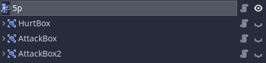
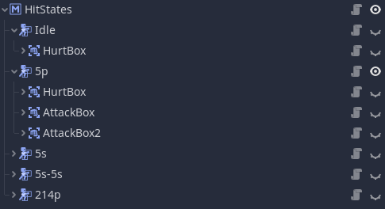

# Collision Module

## Introduction

The Collision module provides tools for hit detection and hitbox management. In fighting games, hitbox configurations often change frequently. A character's hitboxes when standing will vary from the configuration when crouching, attacking, or getting hit. Different hitboxes can also detect different types of attacks and deal different amounts of damage. In Godot, managing multiple hitboxes with varying properties can be tedious, but the Collision module helps simplify the process.

## Hitbox2D/3D

The hitbox node is the simplest level of organization within the collision module. It doesn't provide much functionality out of the box and is essentially just an Area. But what it does provide is a template that you can expand upon through the use of attributes.

`HitboxAttribute` is a resource that can be given to hitboxes to provide attribute data for use during hit detection. Attributes can also determine what hitboxes the parent hitbox can interact with by overriding the `_allows_detection_of_impl()` virtual method. In effect, attributes are components you can attach to a hitbox to determine their type.

### Usage

To use the hitbox node first add it to your desired scene. The hitbox node can be found by searching `FrayHitbox2D` and `FrayHitbox3D` in the node creation dialog. Once added you set the node up identical to an area node meaning a collision shape node must be added as a child. When that is done you use can then connect the `hitbox_intersected` and `hitbox_separated` signals for detecting other hitboxes.

Now suppose you wanted to distinguish between a hurt box (box that detects attacks), and attack box (box that causes damage). Rather than extend the hitbox class, instead extend the `HitboxAttribute` class to create an `AttackAttribute` and `HurtAttribute` respectively. The attribute attached to the hitbox then essentially determines its type. Attribute can then be referenced during hit detection and their data used to influence the response such as how much damage an attack deals.

Example Attribute:

```gdscript
class_name HurtAttribute
extends FrayHitboxAttribute

# In this example we only want hurt boxes to detect attack boxes.
# We can do this by overriding this virtual method.
func _allows_detection_of_impl(attribute: FrayHitboxAttribute) -> void:
    return attribute is AttackAttribute

```

```gdscript
class_name AttackAttribute
extends FrayHitboxAttribute

# Example exports to showcase the kind of data you might associate with an attack.
export var damage: float
export var knockback_force: float
```


## HitState2D/3D

Hit states are the 2nd level of organization the collision module provides. In fighting games you'll often see single actions with multiple discrete hitbox confiugrations. Managing multiple hitboxes in the scene tree can get tedious. To handle this fray includes a hit state node which allows you to manage multiple hitboxes from a single access point.



### Usage

Hitboxes added as direct children of the hit state node will appear in the inspector allowing you to control which hitbox is and isn't active from a single property. This `active_hitbox` property can be keyed in the animation player for easy syncing with attacks. However, BE CAREFUL. This property is based on index so changing a hitbox's position in the tree will affect the behavior. Changing the name is safe.


The hit state node also features a `hitbox_intersected` and `hitbox_separated`. Except unlike the version in hitboxes this one includes the hitbox that was detected as well as which hitbox child detected it.

## HitStateManager2D/3D

Hit states are intended to represent how a fighter is attacking and/or can be attacked at a given moment. In a game with many actions, you'll likey want to use many hit states. For this fray provides a third and final level of organization in the form of hit state managers.

## Usage

When the active hitbox of any of the manager's hit state children changes then the manager will deactive all hit states except the one that changed. Basically, it prevents more than one hit state from being active at a time and automatically enforces discrete hit states.

The hit state manager node also features a `hitbox_intersected` and `hitbox_seperated` that functions identically to the intersect and seperated signal found in the hit state node.

Below is an example of how your tree may look utilizing all the nodes discussed on this page.

