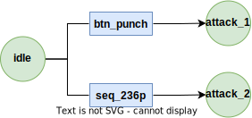

# State Management Module

## Introduction

The state management module includes a hierarchical combat state machine for managing the state of combatants in your game, as well as a general-purpose state machine for capturing more general state flows. State management is an essential part of designing complex game mehchanics, as it helps define different states a game entity can be in, and what actions can be performed in those states. In regards to fighting games, that means defining what buttons transition into what attacks, and what attcks are available during any state.

## Using the CombatStateMachine

For this demonstration we will be using the `FrayCombatStateMachine`, however, all the information regarding building the states and transitions apply to the general purpose `FrayGeneralStateMachine` as well. To get started first add a `FrayCombatStateMachine` from the node creation dialog.

Once the state machine is added to the scene you can begin adding situations. A situation is a `StringName` to `FrayRootState` mapping which represents the set of actions available to a combatant. To add a new situation call the `add_situation()` method on the combat state machine. It accepts 2 arguments, a `StringName`, and a `FrayRootState`. The root state is what actually contains all the information related to states and transitions.

Using the the root state builder the state machine can be assembled inline like so:

```gdscript

@onready var combat_state_machine = $CombatStateMachine

func _ready() -> void:
    combat_state_machine.add_situation("on_ground", FrayRootState.builder()
        .transition_button("idle", "attack_1", {input="btn_punch"})
        .transition_sequence("idle", "attack_2", {sequence="seq_236p"})
        .build("idle")
    )
```

- The `transition_button()` and `transition_sequence()` method both take 3 arguments. A 'from' state `StringName`, a 'to' state `StringName`, and an optional config `Dictionary`. Note the input name is an arbitrary `StringName` and does not inherently reference anything related to the input module.

- The `build()` method will return a root node built using the current build configuration. The first state added to the system will be used for the start state but you can optionally set the start state using the builder's `start_at()` method.
The above situation could be visualized like this:



### Transition configs

The optional config dictionary allows for additional customization of the transition. Each key in the config dict corresponds to a property on the transition it uses.

Below demonstates usage of the `prereqs` config. Prereqs take an array of conditions and only allow the transition to occur when all are true. To update the value of the condition the `set_condition()` method can be called on the `FrayState`.

```gdscript
    combat_state_machine.add_situation("on_ground", FrayRootState.builder()
        .transition_button("idle", "attack_1", {input="btn_punch"})
        .transition_button("idle", "attack_2", {sequence="btn_punch", prereqs=FrayCondition.new("on_hit")})
        .build("idle")
    )

combat_state_machine.get_root().set_condition("on_hit", true)
```

The above situation could be interpreted as the follow up attack only being performable if the previous attack hit.

### Global transitions

Global transitions are a convinience feature that allows you to automatically connect states based on global transition rules. If a rule exists, states with a given 'from_tag' will automatically have a transition setup to global states with a given 'to_tag'. This is useful for setting up transitions which need to be available from multiple states without needing to manually connect them. For example, in many fighting games you could say all attacks tagged as 'normal' may transition into attacks tagged as 'special'.

```gdscript
var builder := Fray.State.CombatSituationBuilder.new()
combat_state_machine.add_situation("on_ground", FrayRootState.builder()
    .transition_button("idle", "attack_1", {input="btn_punch"})
    .transition_button("idle", "attack_2", {input="btn_punch"})
    .transition_sequence_global("special_attack", {sequence="seq_236p"})
    .multi_tag(["idle", "attack_1", "attack_2"], ["normal"])
    .tag("special_attack", ["special"])
    .add_rule("normal", "special")
    .build("idle")
)
```

The above situation could be interpreted as all normal attacks can transition into a special attack.

### Changing situations

To change situations you simply need to update the `current_situation` property on the combat state machine.

```gdscript
combat_state_machine.current_situation = "on_ground"
```

## Restricting transitions

The combat state machine has a `allow_transitions` property. Enabling and disabling this property allows you to control when a combatant is allowed to switch states. For example, if this property is set to false for the entire duration of an attack animation and set to true at the end then functionally the player is unable to interrupt or cancel into another combat state. Conversely if the property is set to true during the attack then the player could cancel into another combat state. This property can be keyed in the animation player allowing for easy syncing with animations.
