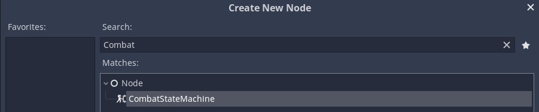

# State Module

## Introduction

The state module features many general purpose scripts related to state management, but to get started you only need to focus on the `CombatStateMachine`, `GraphNodeStateMachineGlobal`, and the `CombatSituationBuilder`.

The `CombatStateMachine` is a node which can contains and switch between multiple situations. In this context a situation just refers to an internal state machine which represents the set of actions available to a combatant. The combat state machine can buffer inputs which are fed to situations to determine what combat state to transition to.

The `CombatSituationBuilder` is just a helper class which makes the construction of situations, represented by the `GraphNodeStateMachineGlobal`, more user-friendly. 


## Adding CombatStateMachine node to the scene tree

If the plugin is enabled then the CombatStateMachine should be available from the 'Create New Node' dialog.




## Using the CombatStateMachine

### Adding situations

To add a new situation call the `add_situation()` method on the combat state machine. It accepts 2 arguments, a string name, and a `GraphNodeStateMachineGlobal`. 

Using the the situation builder the graph node can be built inline. Most builder methods return a reference to the builder allowing for chain method calls.

```swift
var builder := Fray.State.CombatSituationBuilder.new()
combat_state_machine.add_situation("on_ground", builder\
    .transition_button("idle", "attack_1", "btn_punch")\
    .transition_sequence("idle", "attack_2", "seq_236p")\
    .build("idle")
)
```

- The `transition_button()` and `transition_sequence()` method both take 4 arguments. A 'from' state string, a 'to' state string, a string representing the input name, and an optional config dictionary.

- The `build()` method will return a graph node built using the current build configuration. The first state added to the system will be used for the start state but you can optionally pass the start state to this method.

The above situation could be visualized like this:


### Transition configs

The optional config dictioanry allows for additional custimization of the transition. A full list of availabe configs can be found in the doc comments located above the builder transition methods.

Below demonstates usage of the `prereqs` config. Prereqs take an array of conditions and only allow the transition to occur when all are true. To update the value of the condition the `set_condition()` method can be called on the `GraphNodeStateMachine`.

```swift
var builder := Fray.State.CombatSituationBuilder.new()
combat_state_machine.add_situation("on_ground", builder\
    .transition_button("idle", "attack_1", "btn_punch")\
    .transition_button("attack_1", "attack_2", "btn_punch", {
        prereqs = [Fray.State.Condition.new("on_hit")]
    })\
    .build("idle")
)

combat_state_machine.root.set_condition("on_hit", true)
```

The above situation could be interpreted as the follow up attack only being performable if the previous attack hit.


### Global transitions

Global transitions are a convinience feature that allows you to automatically connect states based on global transition rules. If a rule exists. States with a given 'from_tag' will automatically have a transition setup to global states with a given 'to_tag'. This is useful for setting up transitions which need to be available from multiple states without needing to manually connect them. For example, in many fighting games you could say all attacks tagged as 'normal' may transition into attacks tagged as 'special'


```swift
var builder := Fray.State.CombatSituationBuilder.new()
combat_state_machine.add_situation("on_ground", builder\
    .transition_button("idle", "attack_1", "btn_punch")\
    .transition_button("idle", "attack_2", "btn_punch")\
    .transition_sequence_global("special_attack", "seq_236p")\
    .multi_tag(["idle", "attack_1", "attack_2"], ["normal"])\
    .tag("special_attack", ["special"])
    .add_rule("normal", "special")
    .build("idle")
)
```

The abouve situation could be interpreted as all normal attacks can transition into a special attack.

### Changing situations

To change situations you simply need to update the `current_situation` property on the combat state machine.

```
combat_state_machine.current_situation = "on_ground"
```

## Restricting transitions

The combat state machine has a `allow_transitions` property. Enabling and disabling this property allows you to control when a combatant is allowed to switch states. For example, if this property is set to false for the entire duration of an attack animation and set to true at the end then functionally the player is unable to interupt or cancel into another combat state. Conversely if the property is set to true during the attack then the player could cancel into another combat state. This property can be keyed in the animation player allowing for easy syncing with animations.